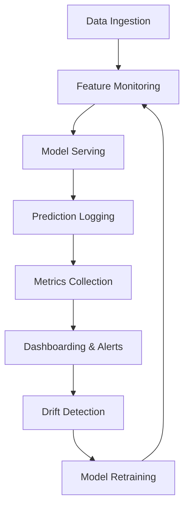

# Chapter 2.9 – Observability & Monitoring for AI Systems

## 2.9.1 Why Observability Matters in AI

Traditional monitoring ensures uptime and system health, but **AI systems demand deeper observability** because:

- Models can silently degrade in performance (data drift, concept drift).
- Predictions may be biased or inaccurate without visible errors.
- Latency and throughput issues in inference pipelines can impact SLAs.
- Regulatory and compliance requirements demand explainability.

Observability in AI is about **seeing inside the “black box”** to track both **system metrics** and **model-specific metrics**.

---

## 2.9.2 Core Metrics for AI Observability

Observability requires monitoring across three layers:

### **1. Infrastructure & System Metrics**

- **CPU, GPU, and memory utilization** (high GPU usage may indicate bottlenecks).
- **Disk and network I/O** (affects data pipelines and distributed training).
- **Pod/container health** in Kubernetes environments.

### **2. Data Metrics**

- **Data distribution drift** – monitor shifts in statistical properties (mean, variance).
- **Feature coverage** – ensure all critical features are present.
- **Data quality** – missing values, corrupted records, schema mismatches.

### **3. Model Metrics**

- **Accuracy, F1-score, AUC, Precision/Recall** in production.
- **Prediction latency** – inference response time.
- **Confidence scores** – distribution shifts in probability outputs.
- **Fairness metrics** – disparate impact, demographic parity.

---

## 2.9.3 Observability Tools & Frameworks

### **System-Level Tools**

- **Prometheus + Grafana**: For infrastructure metrics dashboards.
- **Datadog / New Relic**: SaaS solutions for logs, metrics, traces.

### **Model-Level Tools**

- **Evidently AI** ([https://github.com/evidentlyai/evidently](https://github.com/evidentlyai/evidently)) – Open-source tool for monitoring data drift, concept drift, and model quality.
- **WhyLogs** ([https://github.com/whylabs/whylogs](https://github.com/whylabs/whylogs)) – Data logging and monitoring library.
- **Seldon Alibi Detect** ([https://github.com/SeldonIO/alibi-detect](https://github.com/SeldonIO/alibi-detect)) – Drift, outlier, and adversarial detection.
- **MLflow** ([https://mlflow.org](https://mlflow.org)) – Experiment tracking, can be extended for model monitoring.
- **Arize AI** (freemium) – Production ML observability platform.

---

## 2.9.4 Observability in Practice – Real-World Case Studies

### **Case Study 1: Fraud Detection in Banking**

- **Problem:** A bank deployed a fraud detection ML model. Initially, accuracy was high, but after 6 months, fraud detection rates dropped.
- **Root Cause:** Transaction patterns evolved (new fraud tactics), leading to **concept drift**.
- **Solution:**
  - Implemented **Evidently AI** to monitor drift in transaction features (e.g., frequency of cross-border transfers).
  - Added **Prometheus** dashboards for latency/throughput.
  - Introduced **shadow models** to compare old vs. retrained versions.
  - Enabled automated alerts when drift exceeded thresholds.
- **Outcome:** Reduced undetected fraud by **35%** and improved retraining cadence.

---

### **Case Study 2: Healthcare – Predictive Diagnosis System**

- **Problem:** A hospital used an ML model to predict sepsis risk in ICU patients. Performance degraded when patient demographics shifted during COVID-19.
- **Root Cause:** **Data drift** due to new patient profiles and treatment methods.
- **Solution:**
  - Integrated **WhyLogs** to continuously log feature distributions.
  - Used **Alibi Detect** to identify anomalies in lab results and vital signs.
  - Alerts triggered when model confidence distribution shifted.
  - Deployed human-in-the-loop system: clinicians reviewed edge cases flagged by the model.
- **Outcome:** Model retrained with updated data, restoring **precision and recall to pre-COVID levels**. Trust from clinicians improved due to transparency.

---

### **Case Study 3: E-Commerce Recommendations**

- **Problem:** An e-commerce platform noticed declining click-through rates (CTR) on product recommendations.
- **Root Cause:** **User behavior drift** due to seasonal trends (holiday shopping vs. regular season).
- **Solution:**
  - Monitored **CTR and engagement metrics** alongside data drift.
  - Introduced **seasonality-aware retraining schedules**.
  - Built dashboards in **Grafana** showing real-time CTR by region and device.
  - Experimented with **multi-armed bandits** to dynamically adjust recommendation strategies.
- **Outcome:** Improved recommendation relevance, **CTR increased by 18%**, and retraining costs decreased due to adaptive scheduling.

---

### **Case Study 4: Autonomous Vehicles**

- **Problem:** A self-driving car system showed increased disengagements (human takeover events) in new city deployments.
- **Root Cause:** **Concept drift** in driving environments – construction zones, new signage, unusual intersections.
- **Solution:**
  - Used **telemetry logs + drift detection** on sensor data (LiDAR, camera).
  - Built a pipeline to simulate new environments before real deployment.
  - Human drivers annotated drift scenarios, feeding data back into retraining loops.
- **Outcome:** Faster adaptation to new cities, reducing disengagement events by **42%**.

---

## 2.9.5 Best Practices for AI Observability

- **Define SLOs for ML systems** (e.g., <100ms latency, >90% accuracy).
- **Automate alerts** for model drift, high error rates, or infrastructure issues.
- **Use shadow deployments** (A/B testing new models quietly before rollout).
- **Track lineage** – know which data and code version produced each prediction.
- **Enable explainability tools** for compliance (e.g., SHAP, LIME).
- **Integrate with CI/CD** – monitoring hooks must be part of ML pipelines.
- **Align monitoring to business KPIs** – not just ML metrics (e.g., CTR, revenue impact).

---

## 2.9.6 Lifecycle Flow Diagram

