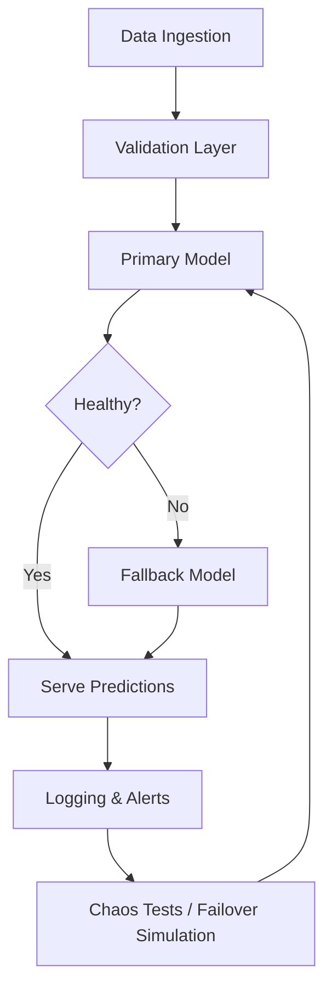

# Chapter 2.10 – Resilience & Fault Tolerance in AI Systems

## 2.10.1 Why Resilience Matters in AI

AI systems often power **mission-critical applications**—from fraud detection in finance to medical diagnostics and autonomous vehicles. Unlike traditional software, **AI systems fail in complex ways**:

- A single corrupt feature can crash an inference pipeline.
- A model might give **confident but wrong predictions** under drift.
- Distributed training jobs may fail midway due to hardware or network issues.
- Hardware (GPU/TPU) failures can create unpredictable downtime.

Resilience and fault tolerance ensure that AI systems can **gracefully degrade**, **self-heal**, and **recover quickly** without disrupting business operations.

---

## 2.10.2 Dimensions of Fault Tolerance in AI

Resilience in AI spans across multiple layers:

### **1. Data Layer**

- **Redundancy in Data Sources:** Use multiple ingestion streams (e.g., primary + backup APIs).
- **Validation & Sanity Checks:** Reject corrupted or incomplete data before inference/training.
- **Schema Enforcement:** Ensure compatibility when upstream data schemas change.

### **2. Model Layer**

- **Fallback Models:** Use simpler backup models (e.g., linear regression) if the primary model fails.
- **Shadow Models:** Run new models in parallel before full deployment.
- **Safe Defaults:** Provide conservative or rule-based responses when the ML model is uncertain.

### **3. Infrastructure Layer**

- **Redundant GPU/TPU nodes** in distributed training.
- **Checkpointing in Training:** Save progress at intervals so jobs can resume after failure.
- **Replica-based Serving:** Multiple replicas handle inference traffic (e.g., Kubernetes horizontal pod autoscaler).

### **4. Application Layer**

- **Graceful Degradation:** If a recommendation engine fails, serve popular items instead.
- **Retry Logic:** Automatic retries for failed service calls.
- **Circuit Breakers:** Prevent cascading failures by isolating failing services.

---

## 2.10.3 Techniques for Fault-Tolerant AI

### **1. Checkpointing & Snapshots**

- Periodically save **model weights** and **training state**.
- Example: PyTorch `torch.save()` + resume from checkpoints.
- Useful for **long training jobs** on unstable GPU clusters.

### **2. Ensemble & Fallback Models**

- Deploy an ensemble of models, falling back to simpler models during outages.
- Example: Fraud detection → deep learning model primary, decision tree fallback.

### **3. Canary & Shadow Deployments**

- **Canary Deployment:** Gradually release a new model to a small fraction of users.
- **Shadow Deployment:** Run new models in parallel (no customer impact) to compare outputs.

### **4. Chaos Engineering for AI**

- Inspired by Netflix’s **Chaos Monkey**.
- Intentionally disrupt model-serving infrastructure:
  - Kill GPU nodes randomly.
  - Corrupt feature inputs to test validation.
- Ensures the system has built-in recovery paths.

### **5. Multi-Region & Cloud-Native Design**

- Deploy across **multiple availability zones** or regions.
- Use **Kubernetes self-healing** (pod restart, auto-scaling).
- Example: Google Cloud AI Platform, AWS SageMaker multi-AZ deployments.

---

## 2.10.4 Case Studies in Resilience

### **Case Study 1: Online Payments Fraud Detection**

- **Problem:** Fraud detection system downtime could allow millions in fraudulent transactions.
- **Solution:**
  - **Dual models:** Gradient boosting (primary) + logistic regression (fallback).
  - **Circuit breaker:** Switch traffic to fallback model if latency > 200ms.
  - **Streaming checkpointing:** Kafka + Flink for data pipelines.
- **Outcome:** Zero downtime in 18 months, fraud losses reduced by **28%**.

---

### **Case Study 2: Predictive Maintenance in Manufacturing**

- **Problem:** AI model predicting machine failures stopped functioning when sensor feed crashed.
- **Solution:**
  - Implemented **schema validation** for IoT data.
  - **Safe defaults:** Alert engineers when model unavailable.
  - **Checkpoint-based retraining** every 24 hours.
- **Outcome:** No missed failures, operators received timely alerts even during outages.

---

### **Case Study 3: Recommendation Engine in E-Commerce**

- **Problem:** Recommendation service crashed during Black Friday traffic spike.
- **Solution:**
  - Horizontal pod autoscaling (Kubernetes).
  - Graceful degradation → fallback to top-selling products.
  - Canary deployment for new models.
- **Outcome:** **Zero downtime** on subsequent peak events, improved user trust.

---

### **Case Study 4: Healthcare AI Diagnostic Tool**

- **Problem:** Cloud API outage prevented radiology scans from being analyzed.
- **Solution:**
  - Local on-premise inference fallback model (lighter CNN).
  - Model snapshots synced daily to local servers.
  - Circuit breaker routing requests to backup cluster.
- **Outcome:** Doctors continued diagnosis with minimal delays, ensuring patient safety.

---

## 2.10.5 Best Practices for Resilient AI

- **Always checkpoint training jobs.**
- **Maintain fallback models** (rule-based or simpler ML).
- **Implement circuit breakers** in ML microservices.
- **Test resilience with chaos engineering.**
- **Separate control plane and data plane** to prevent total outages.
- **Prioritize graceful degradation** aligned with business KPIs.
- **Audit & rehearse failover playbooks** like disaster recovery drills.

---

## 2.10.6 Resilience Lifecycle Flow

