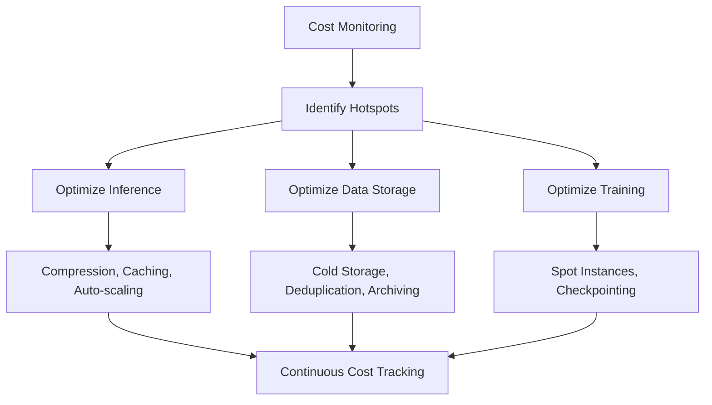

# Chapter 2.11 – Cost Optimization in AI Infrastructure

## 2.11.1 Why Cost Optimization Matters

AI systems are notoriously expensive to build, train, and maintain. Costs arise from:

- **Compute** (GPUs/TPUs for training & inference).
- **Storage** (datasets, model checkpoints, embeddings).
- **Networking** (data transfers between regions).
- **Licensing & SaaS tools** (MLOps platforms, APIs).
- **Engineering time** for maintaining pipelines.

Without cost controls, organizations face **ballooning expenses** with diminishing returns. Cost optimization ensures AI systems remain **financially sustainable** while scaling.

---

## 2.11.2 Cost Drivers in AI Workloads

### **1. Training Costs**

- High due to **long training cycles** on GPU clusters.
- Large batch sizes, hyperparameter sweeps, and retraining contribute to spikes.
- Cloud providers charge per-hour or per-second compute usage.

### **2. Inference Costs**

- Real-time inference requires low-latency, high-throughput systems.
- **Over-provisioning** is common due to unpredictable workloads.
- Model ensembles, though more accurate, increase serving costs.

### **3. Data Costs**

- Storage of raw, processed, and feature-engineered data.
- Frequent **data egress fees** in multi-cloud or hybrid setups.
- Data duplication across staging, training, and production.

### **4. MLOps & Tooling**

- Commercial tools (Databricks, AWS SageMaker, Snowflake) add recurring licensing fees.
- Proprietary APIs (e.g., OpenAI, Hugging Face Inference API) can scale costs rapidly.

---

## 2.11.3 Strategies for Cost Optimization

### **1. Right-Sizing Compute**

- Use **spot instances** for training (cheaper, but preemptible).
- Scale inference with **auto-scaling** (Kubernetes HPA, serverless GPU).
- Profile workloads to choose optimal hardware (e.g., CPUs for light inference).

### **2. Model Compression**

- **Quantization:** Convert FP32 → INT8 to reduce compute.
- **Pruning:** Remove redundant weights with minimal accuracy loss.
- **Knowledge Distillation:** Train smaller models from large teacher models.

### **3. Caching & Reuse**

- Cache inference results for repeated queries (e.g., embeddings).
- Store feature sets in **feature stores** for reuse across models.
- Reuse checkpoints instead of retraining from scratch.

### **4. Multi-Tenancy & Sharing**

- Shared GPU clusters across teams.
- Enforce quotas and budgets per project.
- Multi-tenant feature stores to reduce duplication.

### **5. Data Lifecycle Management**

- Use **tiered storage** (hot vs cold).
- Delete unused checkpoints, logs, and intermediate datasets.
- Automate archiving to low-cost storage (e.g., AWS Glacier).

### **6. Cost-Aware Deployment**

- Route low-value workloads to cheaper models.
- Example: Use a **logistic regression fallback** for low-priority tasks instead of a large transformer.
- Batch non-urgent inference requests.

---

## 2.11.4 Case Studies in Cost Optimization

### **Case Study 1: Ride-Sharing Company**

- **Problem:** Model retraining every day cost millions in GPU time.
- **Solution:**
  - Switched to **incremental retraining** (only update when drift is detected).
  - Used **spot instances** for non-critical training.
- **Outcome:** Training costs reduced by **42%**, no impact on accuracy.

---

### **Case Study 2: E-Commerce Personalization**

- **Problem:** Real-time recommendation engine ran large transformer models for all users.
- **Solution:**
  - Deployed **smaller distilled models** for most users.
  - Cached top-N recommendations for cold-start users.
- **Outcome:** Reduced serving costs by **60%**, improved latency by 30ms.

---

### **Case Study 3: Healthcare Imaging Startup**

- **Problem:** Storing petabytes of medical scans inflated storage bills.
- **Solution:**
  - Applied **lossless compression**.
  - Moved older scans to **cold storage**.
  - Deduplicated identical imaging slices.
- **Outcome:** Annual storage bill dropped by **55%**.

---

### **Case Study 4: Conversational AI Platform**

- **Problem:** API costs skyrocketed due to reliance on external LLMs.
- **Solution:**
  - Built **smaller in-house fine-tuned models** for common tasks.
  - Reserved external API calls for high-value, long-form queries.
- **Outcome:** API spending cut by **70%**, increased control over performance.

---

## 2.11.5 Cost Optimization Framework

**2.11.6 Best Practices Checklist**

- Use spot/preemptible instances for non-critical jobs.
- Apply model compression techniques (quantization, pruning).
- Cache repeated inference queries.
- Monitor cloud bills with cost dashboards (AWS Cost Explorer, GCP Billing).
- Use auto-scaling for inference services.
- Archive old datasets and checkpoints.
- Reuse models & features across teams.
- Build fallback models to reduce dependency on expensive APIs.
