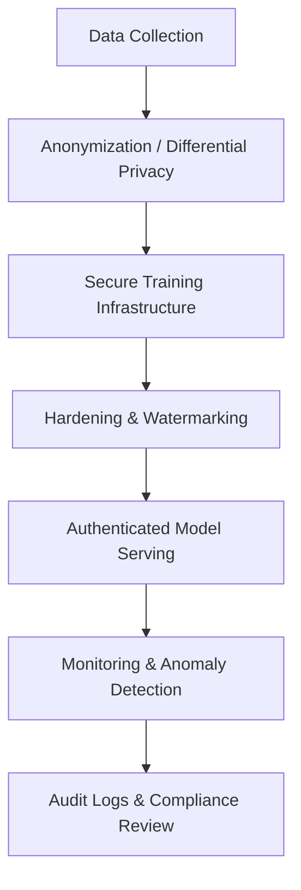

# Chapter 2.12 – Security & Privacy in AI Systems (Deep Dive)

## 2.12.1 Overview: Why Security & Privacy are Core to AI Architecture

As AI systems integrate more deeply into sensitive domains—healthcare, finance, government—they become high-value attack targets and subject to stringent legal regulations. Security and privacy are not add-ons—they must be embedded throughout your architecture.

- **Threat vectors unique to AI**: model inversion, membership inference, adversarial attacks, data poisoning.
- **Privacy concerns**: LLMs can inadvertently reveal personal data; sensitive training corpora need safe handling.
- **Regulatory compliance**: GDPR (EU), HIPAA (US), data privacy laws like CCPA, upcoming AI-specific regulations.

---

## 2.12.2 Threat Spectrum in AI

1. **Model Inversion / Membership Inference Attacks**

   - Attackers query models to reconstruct or infer whether certain data records were in the training set.
   - Case: Reconstruction of voice data from speech-to-text models.

2. **Adversarial Examples**

   - Inputs slightly perturbed to deceive classifiers.
   - Self-driving car systems mislabeled stop signs when stickers were strategically placed.

3. **Data Poisoning**

   - Maliciously altered training data steering the model toward erroneous outputs.
   - Example: Spam classifiers poisoned to whitelist phishing emails.

4. **Model Theft / Extraction**

   - Attackers query services to recreate the model locally.
   - Major concern for proprietary AI APIs like pricing or legal assistants.

5. **Privacy Leakage from LLMs**

   - LLMs trained on proprietary data can unintentionally expose sensitive text.
   - Requires fine prompt control and possible filtering layers.

6. **Supply Chain Risks**
   - Using third-party models or datasets raises risks of biases, backdoors, or illegitimate licensing.

---

## 2.12.3 Legal & Compliance Landscape

- **GDPR (General Data Protection Regulation) – EU**

  - Article 22 (“right to explanation”), data minimization, user consent, data subject rights.

- **CCPA (California Consumer Privacy Act)**

  - Consumer data rights in the US, including opt-out of data sale and deletion requests.

- **HIPAA (Health Insurance Portability and Accountability Act)**

  - Regulates Protected Health Information (PHI) in AI used for medical analytics.

- **AI Act (EU, imminent rollout)**

  - Categorizes AI systems by risk level; high-risk systems (e.g., biometric ID, credit scoring) have strict compliance needs.

- **SOC 2 / ISO 27001**

  - Industry-standard certifications for organizational controls around data and service reliability.

- **NIST AI RMF (Risk Management Framework)**
  - Provides a layered guideline on trustworthy AI lifecycle management.

---

## 2.12.4 Architectural Safeguards & Best Practices

### a) Privacy-by-Design

- Apply **differential privacy** during training to mask individual data contributions.
- Use **federated learning** to keep raw data on-premise or on user devices.
- Aggregation or anonymization of sensitive attributes before model consumption.

### b) Data Protection

- Encrypt data at rest (AES-256) and in transit (TLS 1.3).
- Implement **tokenization and pseudonymization** for sensitive fields.
- Apply **access control**, audit logs, and role-based permissions (RBAC).

### c) Model Hardening

- Utilize **membership inference mitigation** techniques like dropout-based defenses.
- Perform **adversarial training** using perturbed data.
- Watermark proprietary models to detect unauthorized duplicates.

### d) Secure API Practices

- Enforce authentication (OAuth2, JWT) and encrypted endpoints.
- Rate-limit inferences and inject “fuzzing” noise to prevent model stealing.
- Return structured outputs (e.g., JSON with schemas), not raw text.

### e) Supply Chain Verification

- Verify third-party models via checksums, metadata, provenance.
- Use signed containers or repositories.
- Prefer open-source vetted models or scan for vulnerabilities.

### f) Compliance Workflows

- Maintain **Model Cards** and **Datasheets for Datasets**.
- Implement **data subject request (DSR)** capabilities (data deletion/export).
- Keep **full lineage tracking**: from data source → feature store → model version → deployed endpoint.

### g) Monitoring & Incident Response

- Monitor for anomalous input patterns (e.g., repeated queries, out-of-distribution cases).
- Implement **alerting** on suspicious usage.
- Define incident response plays (e.g., model revoke, rollback, investigation).

---

## 2.12.5 Real-World Examples

### **Case Study: Federated Learning in Mobile Keyboard**

- **Implementation:** Gboard uses federated learning to update word suggestions from anonymized user input on-device.
- **Outcome:** Improved personalization without collecting keystroke data centrally, meeting privacy expectations.

### **Case Study: Healthcare Chatbot**

- **Implementation:** HIPAA-compliant deployment with EHR anonymization, differential privacy in logs, audit trail for each request, RBAC-controlled backend.
- **Outcome:** Enables secure AI assistance while preserving patient confidentiality.

### **Case Study: Financial Risk Scoring API**

- **Implementation:** Proprietary model protected via watermarking, rate-limited inference, and output bias auditing.
- **Outcome:** Maintained revenue stream via API product while preventing model theft and regulatory violations.

---

## 2.12.6 Lifecycle Diagram: Secure AI Flow

**2.12.7 Checklist for Secure & Privacy-Compliant AI**

- Differential privacy or federated learning where possible.
- Data anonymized, encrypted, and access-controlled.
- Hardening against adversarial and membership attacks.
- API security (auth, rate-limiting, structured outputs).
- Supply chain verification for models and datasets.
- Complete lineage tracking and auditability.
- Incident response processes for AI-specific breaches.

**Summary**

- Security and privacy in AI require a multi-layered architecture:
- From data anonymization to model watermarking.
- From secure APIs to monitoring and governance.
- Real-world systems (mobile apps, chatbots, APIs) demonstrate that embedding privacy doesn’t limit functionality—it enables trust and scale.
