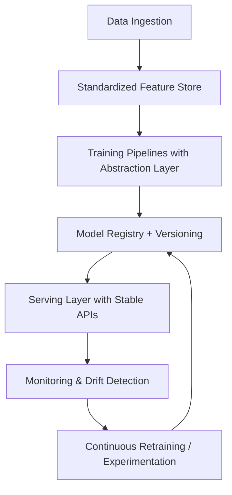

# Chapter 2.13 – Future-Proofing AI Architecture

## 2.13.1 Why Future-Proofing Matters

The AI landscape is evolving rapidly—new model architectures (e.g., transformers → diffusion → mixture-of-experts), new hardware (TPUs, neuromorphic chips), and new regulations (EU AI Act, US AI Bill of Rights). Building an AI system today without considering these shifts risks premature obsolescence.

Future-proofing means:

- **Adaptability** → Ability to plug in emerging models/tech without full rewrites.
- **Resilience** → Robustness against shifts in regulation, data drift, or infrastructure changes.
- **Longevity** → Investments in AI architecture remain relevant as the ecosystem matures.

---

## 2.13.2 Key Principles of Future-Proof AI Systems

1. **Modular Architecture**

   - Decouple components: feature engineering, training, serving, monitoring.
   - Use **domain-driven design (DDD)** for bounded contexts.
   - Example: Separate “Model Store” from “Serving Layer” ensures swapping in a new LLM doesn’t break APIs.

2. **Interoperability & Standards**

   - Adopt **ONNX, MLIR** for model portability across frameworks (TensorFlow, PyTorch, JAX).
   - APIs designed using **OpenAPI/GraphQL** enable forward compatibility.
   - Prefer **containerized deployment** (Docker, OCI) for environment independence.

3. **Cloud + Edge Hybrid Design**

   - Edge inference: reduces latency, increases privacy.
   - Cloud orchestration: centralized control and scalability.
   - Example: Autonomous vehicles → low-latency edge models + cloud retraining pipelines.

4. **Hardware Abstraction**

   - Avoid vendor lock-in (CUDA-only pipelines).
   - Use frameworks like **XLA, OpenVINO, TVM** to support multiple accelerators.
   - Emerging chips (e.g., Graphcore IPUs, Cerebras wafers) require abstraction for smooth adoption.

5. **Regulatory Flexibility**

   - Build compliance hooks (logging, data deletion, fairness auditing).
   - Store **provenance metadata** with each dataset/model.
   - Support future AI audits as compliance becomes mandatory.

6. **Sustainability & Cost-Aware Design**
   - Optimize for energy efficiency (green AI).
   - Use mixed precision (FP16/BF16) and pruning/distillation to reduce costs.
   - Track carbon footprint of training/inference as organizations face ESG reporting.

---

## 2.13.3 Technical Strategies for Future-Proofing

### a) Abstraction Layers

- **Training Pipelines**: Define pipelines declaratively (e.g., Kubeflow, Airflow DAGs).
- **Serving Interfaces**: REST/gRPC APIs stable across model versions.
- **Monitoring Systems**: Pluggable anomaly detectors, independent from specific model outputs.

### b) Versioning & Model Registry

- Semantic versioning for models (e.g., v2.3.1).
- Store full lineage: dataset version → preprocessing code → model artifact → deployment config.
- Enables rollback or forward migration.

### c) Continuous Learning Infrastructure

- Incremental retraining pipelines (e.g., streaming features).
- Safe experimentation: A/B testing, shadow deployments.
- AutoML integrations for rapid exploration of new architectures.

### d) Observability-First Design

- Logs, metrics, and traces for every stage of lifecycle.
- Time-series DBs (Prometheus, InfluxDB) for drift metrics.
- Model interpretability hooks (SHAP, LIME, Captum) for explainability at scale.

### e) “Composable AI” Mindset

- Ability to stitch smaller models into pipelines (e.g., retrieval-augmented generation + LLM).
- Orchestrators like LangChain, Haystack, Ray for hybrid workflows.
- Encourages system-level resilience vs. dependence on a monolith.

---

## 2.13.4 Real-World Case Studies

### **Case Study: Netflix – Multi-Model Recommender**

- **Problem:** Need to evolve recommendation algorithms without disrupting the user experience.
- **Solution:** Modular architecture where ranking, candidate generation, and personalization layers evolve independently.
- **Result:** Ability to integrate deep learning, reinforcement learning, and contextual bandits over time without system rewrites.

### **Case Study: Shopify – AI Fraud Detection**

- **Problem:** Fraud tactics evolve rapidly, requiring frequent model updates.
- **Solution:** Model registry + shadow deployments allowed new models to be tested alongside existing ones.
- **Result:** Reduced downtime and seamless transition to newer architectures.

### **Case Study: OpenAI API**

- **Problem:** API customers shouldn’t care whether model is GPT-3, GPT-3.5, or GPT-4.
- **Solution:** API endpoints abstract away the model, ensuring backward compatibility.
- **Result:** Stable developer ecosystem, future-proof against model upgrades.

---

## 2.13.5 Lifecycle Flow: Future-Proofing in Action

**2.13.6 Checklist for Future-Proof AI**

- Components decoupled via modular design.
- Models portable across frameworks/hardware (ONNX, TVM).
- APIs remain stable regardless of model swap.
- Regulatory compliance hooks in place.
- Continuous retraining pipeline operational.
- Cost and energy efficiency tracked.
- Version-controlled dataset, model, and config lineage.
- Edge-cloud hybrid strategy considered.

**Summary**

Future-proof AI is about building for change. By emphasizing modularity, abstraction, interoperability, and compliance, organizations can ensure that their AI systems remain relevant across emerging model paradigms, hardware accelerators, and legal landscapes. Companies like Netflix, Shopify, and OpenAI demonstrate that adaptability is not just an advantage—it’s a survival strategy.
