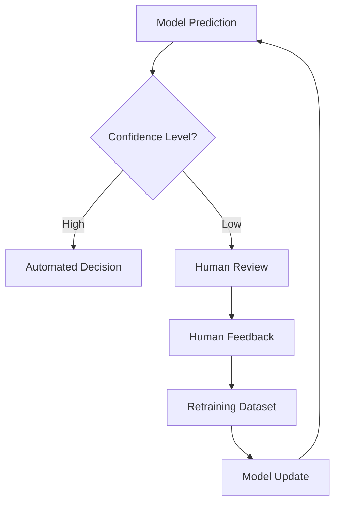

# Chapter 2.14 – Human-in-the-Loop (HITL) AI

## 2.14.1 The Role of Humans in AI Systems

While automation drives efficiency, AI systems—especially in high-stakes domains—cannot operate fully autonomously. Human-in-the-loop (HITL) AI integrates **human judgment** into the AI lifecycle to ensure:

- **Accuracy** → Catching errors models might miss.
- **Accountability** → Transparent decision-making with human oversight.
- **Ethics & Fairness** → Humans validate model outputs against societal and contextual norms.
- **Adaptability** → Humans provide corrections, which feed back into retraining.

---

## 2.14.2 HITL Across the AI Lifecycle

1. **Data Labeling**

   - Humans curate, annotate, and validate datasets.
   - Example: Autonomous driving datasets labeled by human reviewers for edge cases (e.g., unusual traffic signals, accidents).

2. **Model Training**

   - Active learning loops: model identifies uncertain samples, humans label them.
   - Reinforcement learning from human feedback (RLHF): powering systems like ChatGPT.

3. **Model Evaluation**

   - Humans provide subjective evaluation metrics (e.g., fluency, tone, safety).
   - Crowdsourcing platforms (Mechanical Turk, Scale AI) enable diverse evaluations.

4. **Deployment & Operations**

   - Human approvals for critical decisions (medical diagnosis, loan approval).
   - Tiered confidence thresholds:
     - High confidence → automated decision.
     - Low confidence → escalate to human reviewer.

5. **Monitoring & Continuous Learning**
   - Humans review flagged anomalies and drifts.
   - Feedback loop → retraining dataset updates.

---

## 2.14.3 HITL System Architectures

- **Inline HITL** → Human is part of real-time decision flow.  
  Example: Fraud detection system where suspicious transactions are flagged for human review.

- **Post-Hoc HITL** → Humans review samples after model decisions.  
  Example: Content moderation pipelines where AI pre-screens content but humans review edge cases.

- **Feedback-Driven HITL** → Human corrections feed back into active learning loops.  
  Example: Medical image diagnosis systems where radiologists’ corrections improve future predictions.

---

## 2.14.4 Case Studies

### **Case Study: Duolingo – Language Learning**

- **Problem:** AI-generated feedback on grammar sometimes misleading.
- **Solution:** HITL loop where linguists refine AI feedback.
- **Result:** Improved accuracy and learner trust.

### **Case Study: LinkedIn – Job Recommendations**

- **Problem:** Risk of biased or irrelevant recommendations.
- **Solution:** Human curators adjust and validate job suggestions.
- **Result:** Increased click-through rate and fairness.

### **Case Study: Healthcare – Radiology AI**

- **Problem:** AI misinterprets anomalies due to dataset bias.
- **Solution:** Radiologists validate AI diagnoses, with corrections used in retraining.
- **Result:** Safer adoption of diagnostic AI tools.

---

## 2.14.5 Challenges of HITL

- **Scalability** → Human oversight adds latency and cost.
- **Consistency** → Human reviewers may disagree (inter-annotator variability).
- **Burnout** → Repetitive annotation/moderation tasks can lead to fatigue.
- **Bias Reinforcement** → If humans are biased, retrained models inherit these biases.

---

## 2.14.6 Best Practices for HITL Systems

- **Confidence Thresholds:** Route only uncertain cases to humans.
- **Tooling Support:** Provide humans with rich context (explainability, visualizations).
- **Active Learning:** Prioritize human effort on samples with highest information gain.
- **Quality Control:** Multiple human reviewers with consensus mechanisms.
- **Feedback Capture:** Structured formats for corrections to feed back into pipelines.

---

## 2.14.7 HITL Workflow Diagram

**2.14.8 Checklist for HITL Integration**

- Defined thresholds for human escalation.
- Human feedback captured systematically.
- Tools for efficient human annotation/review.
- Mechanisms to reduce reviewer fatigue.
- Clear governance for accountability and ethics.

Summary

Human-in-the-loop AI balances automation with oversight, ensuring that systems remain accurate, ethical, and trustworthy. From radiology to fraud detection to education platforms, HITL enables AI to learn continuously while preventing catastrophic errors. The future of AI is not fully autonomous—it is collaborative intelligence, where humans and machines amplify each other.
