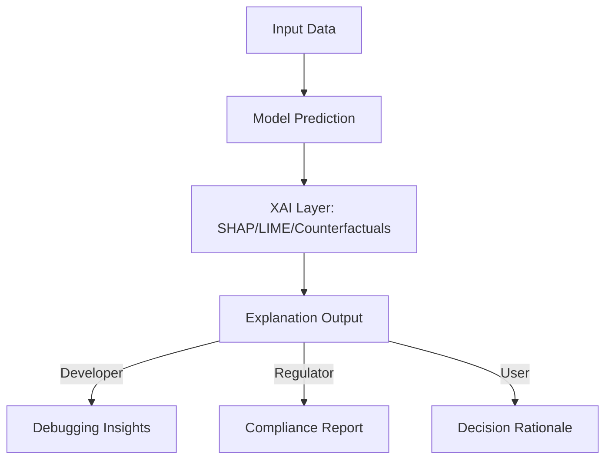

# Chapter 2.15 – Explainable AI (XAI) and Transparency

## 2.15.1 Why Explainability Matters

As AI systems permeate high-stakes domains such as finance, healthcare, and autonomous driving, the need for **explainability** becomes critical. Stakeholders—including regulators, developers, and end-users—demand transparency to ensure:

- **Trust** → Users accept and adopt AI decisions only if they understand them.
- **Accountability** → Organizations must justify AI-driven actions in legal or ethical contexts.
- **Debugging & Improvement** → Developers need visibility into how models behave.
- **Fairness & Ethics** → Explanations help detect and mitigate bias.

---

## 2.15.2 Core Dimensions of Explainability

1. **Transparency** → How understandable is the model architecture itself?
   - Example: Linear regression coefficients are inherently interpretable.
2. **Post-Hoc Interpretability** → Methods that explain black-box models after training.
   - Example: SHAP, LIME.
3. **User-Centric Explanations** → Tailored explanations based on the stakeholder.
   - Example: A regulator might want feature importance, while a doctor needs a risk breakdown.

---

## 2.15.3 Key Techniques in XAI

### Model-Specific Approaches

- **Decision Trees & Rule-Based Systems**: Naturally interpretable.
- **Generalized Linear Models (GLM)**: Offer weight-based feature impact.

### Model-Agnostic Approaches

- **LIME (Local Interpretable Model-agnostic Explanations):**  
  Approximates a black-box model locally with a simple interpretable model.
- **SHAP (SHapley Additive exPlanations):**  
  Uses game theory to assign feature contribution values.
- **Counterfactual Explanations:**  
  Show how inputs must change to flip a decision.

### Visualization Approaches

- Partial Dependence Plots (PDPs).
- Feature importance heatmaps.
- Saliency maps for neural networks (especially in computer vision).

---

## 2.15.4 Challenges in Explainability

- **Trade-Off: Accuracy vs Interpretability**  
  More complex models (deep neural networks) often less interpretable.
- **Audience-Specific Needs**  
  Explanations for developers differ from those for regulators or customers.
- **Adversarial Misuse**  
  Explanations can be exploited to game models (e.g., in fraud detection).
- **Uncertainty in Explanations**  
  Methods like LIME/SHAP provide approximations, not absolute truths.

---

## 2.15.5 Case Studies

### **Case Study: FICO Credit Scoring**

- **Challenge:** Users demanded reasons for loan approval/rejection.
- **Solution:** XAI dashboards highlighting top features (income, credit history).
- **Outcome:** Improved user trust and compliance with U.S. Equal Credit Opportunity Act.

### **Case Study: Google DeepMind Healthcare**

- **Challenge:** Black-box predictions in healthcare risked doctor mistrust.
- **Solution:** Explanations provided via attention maps and key contributing features.
- **Outcome:** Increased adoption by clinicians due to improved interpretability.

### **Case Study: Uber Michelangelo (Fraud Detection)**

- **Challenge:** Fraud analysts needed visibility into why transactions were flagged.
- **Solution:** SHAP-based feature importance scoring integrated into review workflow.
- **Outcome:** Reduced false positives and improved analyst efficiency.

---

## 2.15.6 XAI in Regulatory Contexts

- **GDPR (Europe):** “Right to Explanation” for automated decisions.
- **AI Act (EU):** Strict transparency and risk management obligations.
- **U.S. Federal Agencies:** Increasing push for algorithmic accountability in hiring, healthcare, and lending.

Organizations must embed explainability into **compliance pipelines** to avoid penalties and enhance trust.

---

## 2.15.7 Best Practices for XAI Integration

- Choose inherently interpretable models when stakes are high.
- Layer multiple XAI techniques (e.g., SHAP + PDP).
- Tailor explanations to stakeholders (developers, regulators, end-users).
- Document explanations alongside decisions for audit trails.
- Continuously evaluate whether explanations improve human understanding.

---

## 2.15.8 Workflow Diagram: XAI in the Decision Pipeline

**Summary**

Explainable AI (XAI) transforms opaque black-box systems into trustworthy, auditable, and adoptable AI solutions. Through techniques like SHAP, LIME, and counterfactuals, organizations can bridge the gap between powerful AI models and human understanding. As regulations tighten, XAI is not just a technical add-on but a strategic requirement for deploying AI responsibly.
