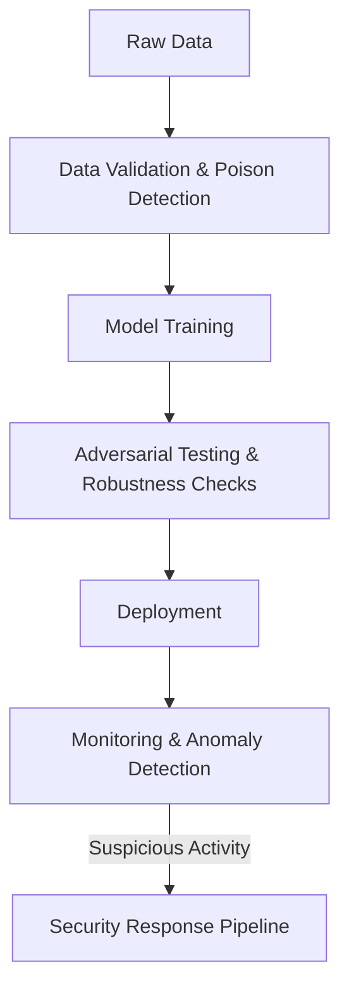

# Chapter 2.16 – Security and Robustness in AI Systems

## 2.16.1 Introduction

AI models, while powerful, are vulnerable to **security threats** and **robustness challenges**. Unlike traditional software, AI systems learn from data, making them susceptible to **data poisoning, adversarial attacks, and model theft**. Ensuring security and robustness is critical for safe deployment in domains like healthcare, finance, and autonomous vehicles.

---

## 2.16.2 Common Threats in AI Systems

### 1. **Adversarial Attacks**

- Tiny, carefully crafted input perturbations cause incorrect predictions.
- Example: Adding subtle noise to an image of a stop sign → misclassified as a speed limit sign by an autonomous vehicle.

### 2. **Data Poisoning**

- Attackers inject malicious samples into the training data to influence the model’s behavior.
- Example: Poisoning spam filter training data with mislabeled spam emails to reduce detection.

### 3. **Model Inversion**

- Extracting sensitive training data by probing a model’s outputs.
- Example: Reconstructing patient medical images from trained AI in healthcare.

### 4. **Model Extraction**

- Adversaries query APIs to replicate models (a.k.a. “model stealing”).
- Example: Stealing proprietary fraud detection models by repeated API queries.

### 5. **Backdoor Attacks**

- Hidden triggers are planted in models during training.
- Example: A malware detection model ignores malicious files with a specific signature.

---

## 2.16.3 Robustness Challenges

- **Distribution Shifts**  
  AI models fail when test data differs from training data (domain shift).
- **Noise Sensitivity**  
  Slight corruptions in input data (e.g., blurry medical scans) cause performance drops.
- **Scalability under Attack**  
  Denial-of-service style attacks via heavy query loads reduce availability.

---

## 2.16.4 Defense Mechanisms

### Adversarial Robustness

- **Adversarial Training:** Train models on adversarial examples.
- **Defensive Distillation:** Smooth decision boundaries to resist perturbations.

### Data Security

- **Differential Privacy:** Protects sensitive training data from leakage.
- **Data Validation Pipelines:** Detect anomalous or poisoned data during ingestion.

### Model Protection

- **Watermarking:** Embed hidden signatures in models to prove ownership.
- **API Rate Limiting:** Prevent large-scale model extraction via controlled queries.

### Monitoring & Response

- **Runtime Anomaly Detection:** Identify unusual input/query patterns.
- **Robust Logging & Auditing:** Enable forensic analysis post-attack.

---

## 2.16.5 Real-World Case Studies

### Case Study 1: Tesla Autopilot & Adversarial Stop Signs

- Researchers modified stop signs with stickers → Tesla autopilot misclassified them.
- Highlighted risks in **physical-world adversarial attacks**.

### Case Study 2: Microsoft Tay Chatbot Poisoning

- Twitter users manipulated chatbot training with toxic input.
- Resulted in biased, unsafe responses within hours of launch.

### Case Study 3: Healthcare Adversarial Images

- Maliciously altered CT scans tricked AI cancer detectors.
- Posed life-threatening risks in clinical deployments.

---

## 2.16.6 Best Practices for Secure & Robust AI

- Conduct **threat modeling** specific to AI lifecycle stages (training, serving, monitoring).
- Use **red-teaming** exercises with adversarial specialists.
- Build **robust MLOps pipelines** that validate data, monitor predictions, and detect anomalies.
- Invest in **robustness benchmarks** (e.g., ImageNet-C, RobustBench).
- Collaborate with **cybersecurity teams** to integrate AI into broader enterprise security posture.

---

## 2.16.7 Workflow Diagram: Secure AI Lifecycle

**Summary**

AI systems are vulnerable to unique and sophisticated security threats. Robust AI design involves adversarial resilience, secure data pipelines, and real-time monitoring. Case studies from Tesla, Microsoft, and healthcare illustrate that failures in robustness can have life-threatening and reputational consequences.
