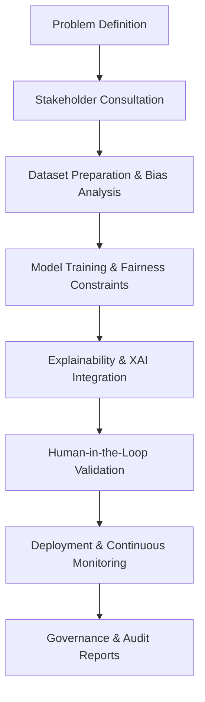

# Chapter 2.17 – Ethical AI and Responsible Deployment

## 2.17.1 Why Ethics Matters in AI

AI systems are increasingly making decisions that directly impact humans. Ethical considerations ensure:

- **Fairness** → Avoid discrimination based on gender, race, or socioeconomic status.
- **Transparency** → Users understand why AI makes certain decisions.
- **Accountability** → Organizations are responsible for AI-driven outcomes.
- **Trust & Adoption** → Ethical AI fosters confidence among users, regulators, and society.

Without ethical principles, AI risks reinforcing biases, causing harm, and facing regulatory penalties.

---

## 2.17.2 Key Ethical Principles

1. **Fairness**

   - Equal treatment across demographic groups.
   - Techniques: bias audits, fairness-aware model training.

2. **Accountability**

   - Clear ownership for decisions, errors, or misuse.
   - Documented model lineage, decision logs, and governance processes.

3. **Transparency & Explainability**

   - Users and stakeholders must understand AI reasoning.
   - Tools: SHAP, LIME, attention visualization.

4. **Privacy & Data Governance**

   - Respect for personal data, minimizing collection, and applying differential privacy.

5. **Safety & Reliability**

   - Robust testing, monitoring, and error recovery.
   - Redundancy in critical applications (autonomous driving, healthcare).

6. **Sustainability**
   - Energy-efficient AI models to reduce environmental impact.

---

## 2.17.3 Frameworks and Guidelines

- **OECD AI Principles** – Inclusive growth, transparency, robustness, accountability.
- **EU AI Act (Draft)** – Risk-based AI regulation; high-risk AI requires strict oversight.
- **IEEE Ethically Aligned Design** – Recommendations for human-centered AI design.
- **NIST AI Risk Management Framework (RMF)** – Mitigation strategies for trustworthy AI.
- **Partnership on AI** – Community-led best practices for responsible AI.

---

## 2.17.4 Bias Detection and Mitigation

### Bias Sources

- **Data Bias:** Training data unrepresentative of population.
- **Algorithmic Bias:** Model learning patterns that amplify unfair correlations.
- **Deployment Bias:** Feedback loops or environmental changes affect fairness.

### Mitigation Techniques

- **Pre-processing:** Resample or reweight datasets to reduce bias.
- **In-processing:** Include fairness constraints in the loss function.
- **Post-processing:** Adjust outputs to correct disparities.

### Tools

- **AIF360 (IBM)** – Bias detection and mitigation.
- **Fairlearn (Microsoft)** – Fairness assessment and mitigation in Python.
- **What-If Tool (Google)** – Visual exploration of model fairness.

---

## 2.17.5 Responsible Deployment Practices

1. **Stakeholder Consultation**

   - Include ethicists, domain experts, and affected users.

2. **Documentation & Model Cards**

   - Document purpose, limitations, and known biases.

3. **Continuous Monitoring**

   - Track performance and fairness metrics after deployment.

4. **Human Oversight**

   - Implement human-in-the-loop for critical decisions.

5. **Governance & Policies**
   - Ethical review boards, AI ethics committees, and compliance audits.

---

## 2.17.6 Case Studies

### Case Study 1: COMPAS Recidivism Tool

- Algorithmic bias detected in criminal risk scores against certain demographics.
- Outcome: Awareness of fairness issues prompted the development of mitigation frameworks.

### Case Study 2: Amazon Recruitment AI

- AI model penalized resumes from female candidates.
- Outcome: Scrapped tool; highlighted the need for bias audits before deployment.

### Case Study 3: Google Healthcare AI

- Model validated with diverse patient data and human oversight.
- Outcome: Reduced biased treatment recommendations; higher clinician adoption.

---

## 2.17.7 Workflow Diagram: Responsible AI Deployment

**2.17.8 Checklist for Ethical AI**

- Bias audits pre- and post-deployment.
- Explainable and transparent models.
- Human oversight for critical decisions.
- Compliance with GDPR, EU AI Act, and local regulations.
- Sustainability metrics tracked.
- Documentation (Model Cards, Datasheets).
- Governance processes in place (ethics boards, review committees).

**Summary**

Ethical AI is not optional; it is foundational to building trustworthy, responsible, and legally compliant AI systems. Combining fairness, transparency, human oversight, and governance ensures AI delivers value without harming individuals or society.
