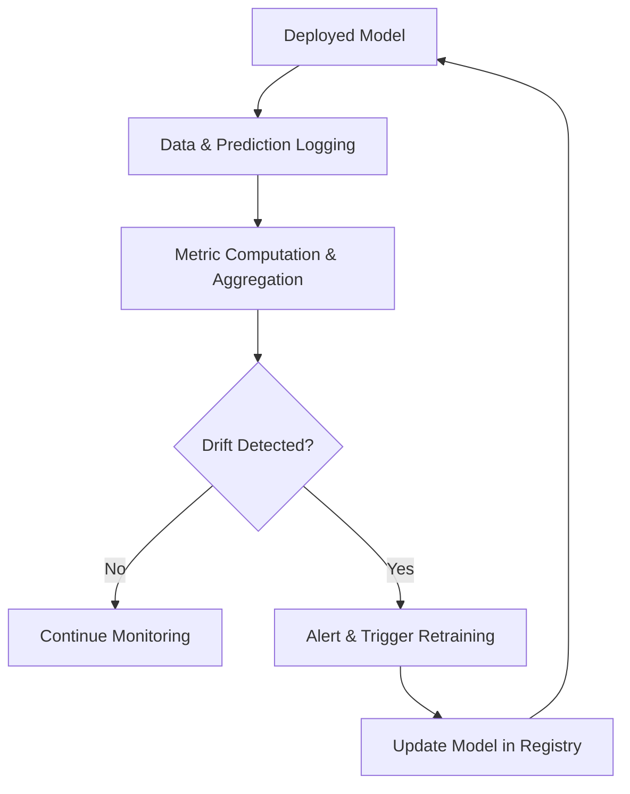

# Chapter 2.19 – Observability, Monitoring, and Model Drift Detection

## 2.19.1 Introduction

Once AI models are deployed, **continuous observability** ensures they perform reliably and safely. Observability is not just monitoring performance metrics; it involves understanding **why models behave the way they do** and detecting **model drift** before it impacts users.

Key concepts:

- **Observability:** Ability to understand the internal state of models from outputs.
- **Monitoring:** Tracking key metrics (accuracy, latency, error rates).
- **Model Drift:** Changes in input data distribution or feature behavior that degrade model performance.

---

## 2.19.2 Types of Drift

1. **Concept Drift**

   - The relationship between input features and target changes over time.
   - Example: Customer churn predictors may change after new market regulations.

2. **Data Drift**

   - Input data distribution changes while the underlying task remains the same.
   - Example: Sensor readings in autonomous vehicles change seasonally.

3. **Feature Drift**

   - Individual features change distribution, causing performance degradation.

4. **Label Drift**
   - Target labels distribution changes.
   - Example: User ratings evolve over time, affecting recommender systems.

---

## 2.19.3 Observability Metrics

- **Performance Metrics:** Accuracy, precision, recall, F1, ROC-AUC.
- **Prediction Distribution:** Compare current predictions vs training predictions.
- **Input Feature Stats:** Mean, variance, skewness, and histograms.
- **Uncertainty Metrics:** Confidence intervals, entropy of predictions.
- **Resource Utilization:** Latency, GPU/CPU usage, memory footprint.

---

## 2.19.4 Tools for Observability and Monitoring

- **Prometheus + Grafana:** Metrics collection and dashboarding.
- **Seldon Deploy:** Real-time monitoring for model predictions and drift.
- **Fiddler AI / WhyLabs:** Observability and explainability dashboards.
- **Evidently AI:** Monitors data and concept drift for ML models.
- **Weights & Biases:** Tracks metrics, distributions, and alerts on drift.

---

## 2.19.5 Techniques for Drift Detection

### Statistical Methods

- **Kolmogorov-Smirnov Test:** Compare feature distributions.
- **Population Stability Index (PSI):** Detect shifts between training and current data.
- **Jensen-Shannon Divergence:** Quantify changes in probability distributions.

### Model-Based Methods

- **Error Monitoring:** Detect unexpected spikes in error rates.
- **Retraining Triggers:** Automate retraining when metrics exceed thresholds.
- **Embedding-Based Detection:** Compare embeddings of incoming data to training embeddings.

### Visualization

- Histograms, density plots, cumulative distribution functions (CDFs).
- Time-series plots of metrics and feature statistics.

---

## 2.19.6 Workflow Diagram: Observability & Drift Detection

**2.19.7 Real-World Case Studies**

**_Case Study 1: Netflix Recommendation Drift_**

- **Issue**: User behavior patterns change seasonally.
- **Solution**: Real-time monitoring of feature distributions and prediction drift.
- **Outcome**: Early retraining reduced incorrect recommendations.

**_Case Study 2: Financial Fraud Detection_**

- **Issue**: Fraud patterns evolve rapidly.
- **Solution**: Streaming feature monitoring with alert triggers.
- **Outcome**: Reduced false negatives and improved detection.

**_Case Study 3: Industrial IoT Predictive Maintenance_**

- **Issue**: Sensor degradation caused model failures.
- **Solution**: Feature drift detection and retraining pipeline.
- **Outcome**: Maintained uptime and predictive accuracy.

**2.19.8 Best Practices**

- Define Baselines: Track metrics relative to training data distribution.
- Automate Alerts: Detect drift before performance degrades.
- Integrate Retraining Pipelines: Close the loop from detection to update.
- Use Multiple Drift Detection Methods: Combine statistical and model-based approaches.
- Document Observability: Keep logs for audits and root cause analysis.

**Summary**

Observability and drift detection are critical pillars of production-grade AI systems. By continuously monitoring inputs, predictions, and performance metrics, organizations can ensure reliability, fairness, and trustworthiness. Incorporating automated retraining and alerts allows AI systems to adapt proactively to changing environments.
