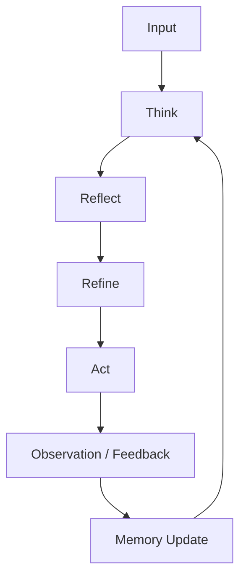

# Chapter 2.22 – Agentic AI Fundamentals

## 2.22.1 Introduction

Agentic AI goes beyond traditional LLM applications. Instead of merely responding to prompts, **agents can reason, plan, act autonomously, and interact with tools** to achieve goals.

Key distinctions:

- **Agents ≠ “just LangChain”**: true agents combine reasoning loops, memory, tool use, and multi-agent coordination.
- **Reasoning Loops**: Think-Reflect-Act cycles allow agents to iteratively refine outputs.
- **Memory**: Short-term context + long-term memory stores maintain state across interactions.
- **Tools & APIs**: Agents can call external APIs, databases, and execute tasks beyond text generation.
- **Multi-Agent Topologies**: Complex workflows may involve multiple agents collaborating or specializing.

**Expert Sources**:

- Lilian Weng – essays on agent systems and risks [https://lilianweng.github.io/lil-log/](https://lilianweng.github.io/lil-log/)
- LangGraph – stateful agent orchestration [https://github.com/langgraph/langgraph](https://github.com/langgraph/langgraph)
- Karpathy GPT/tokenizer deep dive for low-level intuition [https://www.youtube.com/watch?v=kCc8FmEb1nY](https://www.youtube.com/watch?v=kCc8FmEb1nY)

---

## 2.22.2 Agent Architecture

1. **Input Processing**

   - Accepts user prompts, events, or sensor data.
   - Normalizes inputs for reasoning modules.

2. **Reasoning / Planning Loop**

   - Generates candidate actions or plans.
   - Evaluates potential outcomes via reflection or simulation.
   - Applies safety/guardrails checks.

3. **Memory Management**

   - **Short-term**: Conversation history, recent states.
   - **Long-term**: Knowledge graphs, embeddings in vector DBs.
   - **Mechanisms**: FAISS, Chroma, or Pinecone (free tiers for practice).

4. **Tool Integration**

   - API calling, DB querying, math solving, scheduling, web scraping.
   - Tool outputs feed back into reasoning loops.

5. **Action Execution**

   - Dispatch commands, generate responses, or trigger workflows.

6. **Observation / Feedback**
   - Track success/failure of actions.
   - Update memory and plan future actions.

---

## 2.22.3 Reasoning Loops: Reflect-Refine Pattern

- **Step 1: Think**  
  Generate initial plan/response.

- **Step 2: Reflect**  
  Check reasoning consistency, possible errors, or conflicts.

- **Step 3: Refine**  
  Update plan or answer using reflection insights.

- **Step 4: Act**  
  Execute output or call tools.

- **Step 5: Learn / Memory Update**  
  Store results, update embeddings, or feedback loops.

## 2.22.5 Tool Integration Patterns

- **Direct API Calls**: Agent calls an external service.
- **Function Calling**: LLM generates JSON instructions for programmatic execution.
- **Command Queues**: Multi-agent systems coordinate via task queues.
- **Sandboxing / Safety**: Limit agent permissions, validate inputs/outputs.

**Example Tools**

- Python functions: calculation, file manipulation
- Web APIs: weather, stock prices
- Database queries: vector DB lookups
- System operations: Docker/K8s triggers

---

## 2.22.6 Multi-Agent Topologies

- **Master-Agent / Worker-Agent**

  - Master assigns subtasks to specialized workers.

- **Peer-to-Peer Agents**

  - Agents communicate to collaborate on problem-solving.

- **Hierarchical Agents**

  - Layers of reasoning, each refining or validating outputs of lower layers.

- **Reliability Tactics**
  - Consensus-based decision making
  - Retry loops
  - Logging & monitoring at agent level

---

## 2.22.7 Real-World Example: Autonomous Research Assistant

**Scenario:**

- Multi-agent system helps engineers find papers, summarize insights, and draft reports.

**Agents Involved:**

1. **Search Agent**: Queries scientific databases.
2. **Summarization Agent**: Condenses findings.
3. **Planning Agent**: Generates next steps.
4. **Review Agent**: Cross-checks facts and adds references.

**Workflow:**

- User input → Search Agent → Summarization → Planning → Review → Output → Memory update

---

## 2.22.8 Best Practices for Agentic AI

- Maintain **stateful memory** for multi-turn reasoning.
- Apply **reflect-refine loops** to reduce hallucinations and errors.
- Use **tool access controls** and sandboxing.
- Monitor agent behavior via **logging and dashboards**.
- Start with **single-agent prototypes** before multi-agent deployment.
- Experiment with free tools (FAISS, Pinecone free tier, LangGraph) for practical labs.

---

### Summary

Agentic AI introduces **autonomy, memory, planning, and tool usage** to LLMs. Proper architecture, reasoning loops, and multi-agent coordination enable robust and practical AI systems for real-world applications.
