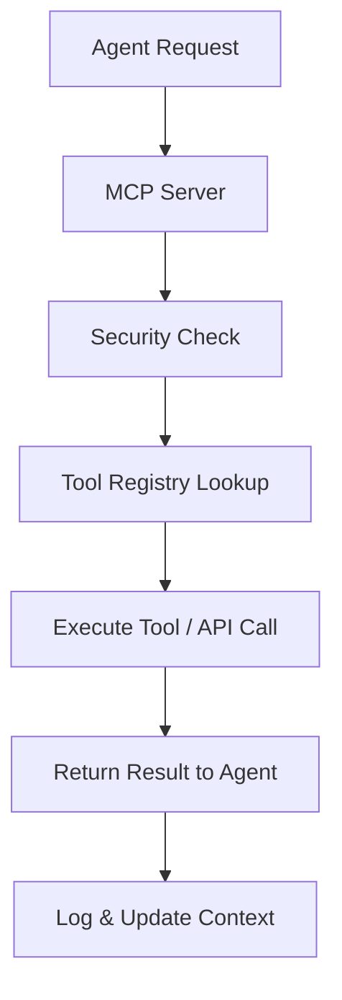

# Chapter 2.23 – MCP (Model Context Protocol) & Tool Ecosystem Integration

## 2.23.1 Introduction

The **Model Context Protocol (MCP)** standardizes how agents interact with tools, APIs, and external systems. It provides **secure, predictable, and scalable communication patterns** for AI agents in production environments.

Key goals:

- Abstract tool interfaces for agents.
- Ensure **security boundaries** and avoid accidental access.
- Enable **multi-agent orchestration** with consistent context handling.

Expert Sources:

- Anthropic MCP Docs: [https://docs.anthropic.com/mcp](https://docs.anthropic.com/mcp)
- Hugging Face MCP Course: [https://huggingface.co/course/chapter9](https://huggingface.co/course/chapter9)

---

## 2.23.2 MCP Fundamentals

1. **Context Passing**

   - Standardized way to provide agents with relevant input context.
   - Includes memory embeddings, tool outputs, and previous actions.

2. **Action Protocol**

   - Agents send **structured commands** (JSON or typed payloads) to tools.
   - Ensures deterministic execution and logging.

3. **Security Boundaries**

   - Define which tools an agent can access.
   - Sandbox execution prevents malicious behavior or accidental damage.

4. **Versioning**
   - Agents and tools evolve independently.
   - MCP ensures backward compatibility and safe updates.

---

## 2.23.3 Tool Ecosystem Patterns

1. **Local Tools**

   - Python scripts, OS commands, Docker/K8s triggers.
   - Directly callable by the agent via MCP-defined interface.

2. **Remote APIs**

   - External services (weather, finance, knowledge bases).
   - Calls standardized via MCP to abstract authentication and rate limits.

3. **Databases / Vector Stores**

   - FAISS, Pinecone, Chroma for embeddings.
   - MCP ensures agents query data consistently and securely.

4. **Orchestration & Queues**
   - Task queues allow multi-agent coordination.
   - Agents publish results; dependent agents subscribe via MCP channels.

---

## 2.23.4 Designing an MCP Server

**Core Components:**

1. **Request Handler**
   - Receives agent commands and context.
2. **Tool Registry**
   - Maintains available tools and versions.
3. **Security Middleware**
   - Checks permissions and sandbox rules.
4. **Execution Engine**
   - Runs requested tool actions and returns outputs.
5. **Logging & Monitoring**
   - Captures all agent interactions for auditing.

---

## 2.23.5 Example Workflow

- Agent sends structured action + context.
- MCP server validates, routes, executes, and logs results.
- Feedback loop updates agent memory and future decisions.

---

## 2.23.6 Real-World Example: Knowledge Worker Agent

- **Scenario:** Multi-agent system assisting enterprise analysts.
- **Agents:**
  1. Data Agent → Queries internal databases.
  2. Analysis Agent → Processes and summarizes results.
  3. Reporting Agent → Formats findings and generates reports.
- **MCP Role:** Coordinates tool access, ensures agents do not exceed permissions, and maintains context for seamless multi-agent reasoning.

---

## 2.23.7 Best Practices

- **Abstract tool interfaces** to simplify agent development.
- **Enforce strict sandboxing** to reduce risk of accidental damage.
- **Version tools & protocols** to allow safe updates.
- **Log all agent-tool interactions** for audits and debugging.
- **Start simple**: single-agent + one tool → multi-agent orchestration.
- **Use free tiers for labs:** FAISS, Pinecone, and Hugging Face hosted APIs.

---

### Summary

MCP provides a **structured and secure framework** for agent-tool integration. By standardizing context passing, execution, and logging, MCP enables **reliable multi-agent systems** with predictable behavior, easier debugging, and safer deployment.

---

👉 Next chapter: **2.24 – RAG Beyond the Basics (Advanced Retrieval-Augmented Generation Patterns)**
