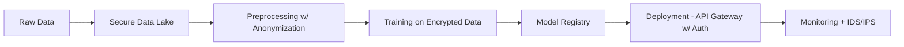
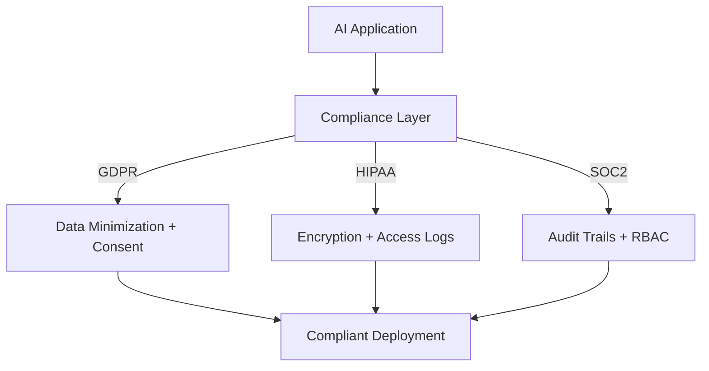

# Chapter 2: AI System Design & Architecture Foundations

## 2.5 Security & Compliance in AI Systems

As AI systems become integral to critical business operations, **security and compliance** are no longer optional—they are essential pillars. Security ensures that systems remain **confidential, integral, and available**, while compliance ensures adherence to **legal, ethical, and regulatory frameworks** such as GDPR, HIPAA, or SOC2.

---

### 2.5.1 Security Threats in AI Systems

1. **Data Poisoning Attacks**

   - Malicious data injected during training corrupts the model.
   - Example: Poisoned medical images leading to wrong diagnoses.

2. **Model Inversion Attacks**

   - Attackers extract sensitive data from model outputs.
   - Example: Reconstructing faces from a facial recognition system.

3. **Adversarial Attacks**

   - Perturb inputs to cause misclassification.
   - Example: Slight pixel noise tricking self-driving car vision systems.

4. **Model Stealing**

   - Repeated API queries used to replicate proprietary models.
   - Example: Competitors cloning paid API models.

5. **Infrastructure Exploits**
   - Exploiting insecure endpoints, misconfigured S3 buckets, weak IAM roles.

---

### 2.5.2 Security Best Practices

1. **Data Security**

   - Encrypt data at rest (AES-256) and in transit (TLS 1.3).
   - Apply strict access control (RBAC, IAM).

2. **Model Security**

   - Apply watermarking or fingerprinting to detect stolen models.
   - Use differential privacy in training.

3. **API Security**

   - Enforce authentication (OAuth2, JWT).
   - Rate-limit inference requests to prevent model stealing.

4. **Infrastructure Security**

   - Harden Kubernetes clusters.
   - Isolate workloads with service mesh (e.g., Istio, Linkerd).

5. **Monitoring & Intrusion Detection**
   - Detect anomalies in request patterns.
   - Example: Unusual frequency of API calls → possible model extraction attempt.

---

### 2.5.3 Compliance Considerations

1. **GDPR (General Data Protection Regulation)**

   - EU regulation on personal data handling.
   - Key: Right to be forgotten, explainability of AI decisions.

2. **HIPAA (Health Insurance Portability and Accountability Act)**

   - Protects sensitive healthcare data in the US.
   - AI medical apps must comply with PHI handling rules.

3. **CCPA (California Consumer Privacy Act)**

   - Gives California residents rights over their personal data.
   - Similar implications for AI-driven personalization.

4. **SOC 2**

   - Security/compliance certification for service organizations.
   - Requires controls over security, availability, confidentiality.

5. **AI-Specific Regulations**
   - EU AI Act: Defines risk categories for AI applications.
   - Example: High-risk systems (biometrics, medical AI) face strict compliance.

---

### 2.5.4 Case Studies

**Case Study 1: Microsoft Azure AI Security**

- Implements **end-to-end encryption, RBAC, differential privacy**.
- Offers **compliance certifications** (SOC, ISO, GDPR).
- Result: Widely trusted by enterprises for sensitive AI workloads.

**Case Study 2: Google Cloud Healthcare AI**

- HIPAA-compliant ML services.
- Differential privacy applied to medical datasets.
- Result: Enables secure adoption of AI in hospitals.

**Case Study 3: Tesla Autopilot**

- Challenge: Adversarial attacks against self-driving AI.
- Approach: Redundant sensor fusion (vision, radar).
- Continuous monitoring for adversarial anomalies.

---

### 2.5.5 Security & Compliance Architecture

#### Secure AI Pipeline

**_Compliance Enforcement Layers_**

**2.5.6 Security & Compliance Checklist**

- Encrypt all data at rest and in transit.
- Apply RBAC and IAM to all components.
- Perform adversarial robustness testing.
- Monitor APIs for model stealing attempts.
- Maintain audit trails for compliance.
- Regular penetration testing.
- Data anonymization & differential privacy.
- Maintain compliance certifications (SOC2, ISO, GDPR, HIPAA).

**✅ Summary**

- Security threats (poisoning, adversarial attacks, model theft) are rising.
- Best practices: encryption, RBAC, monitoring, adversarial defense.
- Compliance frameworks (GDPR, HIPAA, SOC2, EU AI Act) define obligations.
- Leading AI companies (Microsoft, Google, Tesla) apply layered security + regulatory compliance for enterprise adoption.
