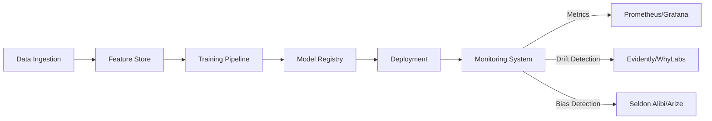

# Chapter 2: AI System Design & Architecture Foundations

## 2.6 AI Observability and Monitoring

As AI systems move from research prototypes to **production-critical infrastructure**, observability becomes essential. Unlike traditional software, AI introduces **model drift, data quality issues, bias, and explainability challenges** that require dedicated monitoring frameworks.

---

### 2.6.1 Why AI Observability is Different

1. **Dynamic Data Environments**

   - Incoming data may differ significantly from training data.
   - Example: An e-commerce recommendation model trained on pre-pandemic data may perform poorly post-pandemic.

2. **Model Drift**

   - **Data Drift**: Distribution of input data changes.
   - **Concept Drift**: Relationship between input and output changes.

3. **Bias and Fairness**

   - AI models may inadvertently discriminate.
   - Requires fairness monitoring in production.

4. **Explainability Requirement**

   - Black-box models (deep learning) need monitoring for interpretability.

5. **Cost & Performance Monitoring**
   - AI workloads consume GPUs/TPUs → financial overhead.
   - Requires real-time monitoring of compute utilization.

---

### 2.6.2 Observability Dimensions

1. **Data Monitoring**

   - Track schema changes, missing values, anomalies.
   - Example tools: Great Expectations, TFX Data Validation.

2. **Model Monitoring**

   - Track model accuracy, precision/recall, confusion matrix.
   - Monitor for drift in output distributions.

3. **System Monitoring**

   - CPU/GPU utilization, memory, latency, throughput.
   - Example tools: Prometheus, Grafana.

4. **Business Metrics Monitoring**
   - AI should align with business KPIs.
   - Example: Click-through rate, fraud detection success rate.

---

### 2.6.3 Monitoring Tools & Platforms

- **Prometheus + Grafana** → Low-level metrics (CPU, GPU, latency).
- **Seldon Alibi Detect** → Drift detection & adversarial monitoring.
- **Evidently AI** → Open-source monitoring for ML drift, bias, fairness.
- **WhyLabs** → Continuous data quality monitoring.
- **Arize AI** → Observability platform for ML performance in production.
- **Monte Carlo Data** → Data reliability (schema, lineage).

---

### 2.6.4 Observability Framework

#### AI Observability Pipeline

### 2.6.5 Drift Detection Techniques

1. **Statistical Drift Detection**

   - Kolmogorov-Smirnov test, Jensen-Shannon divergence.
   - Detects changes in feature distribution.

2. **Embedding Drift**

   - Monitor embeddings from deep networks.
   - Example: NLP word vector drift when language evolves.

3. **Performance Drift**

   - Track model accuracy on labeled live data.

4. **Business Drift**
   - When business KPIs drop (e.g., drop in CTR).

---

### 2.6.6 Case Study – Monitoring Drift in a Fraud Detection Model

- **Problem:** A bank deployed a fraud detection model. Over time, fraudsters changed tactics.
- **Observability Setup:**
  - Data drift monitored via KS-test on transaction amount distribution.
  - Concept drift tracked by precision/recall on labeled fraud outcomes.
  - Alerts triggered in Grafana when metrics deviated.
- **Outcome:** Model retraining was automated when drift persisted for 3 days.
- **Impact:** Reduced fraud losses by 18% within 6 months.

---

### 2.6.7 Best Practices for AI Observability

- Monitor **both technical and business metrics**.
- Build **dashboards** for model & infra in one place.
- Automate **alerts and retraining triggers**.
- Integrate **explainability tools** (SHAP, LIME) with monitoring.
- Include **human-in-the-loop** feedback for continuous labeling.

---
