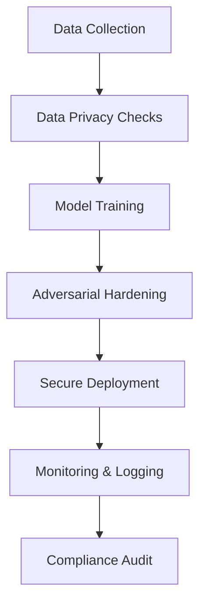

# Chapter 2.8: Security & Compliance in AI Systems

AI systems handle sensitive data, operate in regulated environments, and often make decisions that directly impact people’s lives. This makes **security and compliance** a first-class concern in AI architecture. Unlike traditional applications, AI systems face additional risks such as adversarial attacks, data poisoning, and model inversion, which can compromise both data privacy and trust.

---

## 2.8.1 Why Security & Compliance Matter

- **Trust & Adoption**: Organizations and users must trust AI outcomes to adopt them.
- **Data Sensitivity**: Models often train on personal or regulated data (health, finance, legal).
- **Regulatory Requirements**: GDPR, HIPAA, SOC2, ISO 27001, and upcoming **EU AI Act** mandate clear safeguards.
- **Business Continuity**: A compromised AI system can cause financial fraud, wrong diagnoses, or even legal penalties.

---

## 2.8.2 Key Security Challenges in AI

1. **Data Privacy Risks**

   - Models can unintentionally memorize sensitive data.
   - Model inversion attacks can reconstruct training data.
   - Example: Exposing patient names from a trained NLP healthcare model.

2. **Adversarial Attacks**

   - Slightly modified inputs can cause large misclassifications.
   - Example: A modified stop sign read as a speed limit by self-driving cars.

3. **Data Poisoning**

   - Malicious actors inject biased or mislabeled data during training.
   - Example: Fraudulent transactions mislabeled as legitimate in banking datasets.

4. **Model Theft**
   - Attackers query APIs repeatedly to replicate model behavior.
   - Example: Competitor extracts pricing model from SaaS AI API.

---

## 2.8.3 Compliance & Legal Frameworks

- **GDPR (Europe)**: Right to be forgotten, data minimization, explainability.
- **HIPAA (Healthcare, US)**: Protects electronic health records (EHR).
- **EU AI Act (2026 rollout expected)**: Classifies AI systems into risk categories.
- **SOC 2 / ISO 27001**: Ensures operational controls for handling sensitive AI pipelines.
- **NIST AI Risk Management Framework (AI RMF)**: US guideline for trustworthy AI.

---

## 2.8.4 Secure AI Architecture Best Practices

1. **Data Layer Security**

   - Encrypt training and inference data at rest and in transit.
   - Apply **differential privacy** for anonymization.

2. **Model Security**

   - Add **adversarial training** to harden against input manipulation.
   - Regularly test for **membership inference attacks**.

3. **Pipeline Security**

   - Use signed, version-controlled datasets and models.
   - Apply access control and audit logging for all ML ops.

4. **Deployment Security**

   - Rate-limit inference APIs to prevent extraction attacks.
   - Use runtime monitoring (e.g., **Datadog, Prometheus**) for anomaly detection.

5. **Explainability & Auditability**
   - Build model cards and datasheets for AI systems.
   - Keep **lineage metadata**: where data came from, preprocessing steps, and model versions.

---

## 2.8.5 Real-World Case Studies

### Case Study 1: Healthcare AI (Radiology Diagnosis)

- **Problem**: Radiology AI trained on hospital data raised GDPR concerns.
- **Solution**: Applied _federated learning_ across multiple hospitals to avoid centralizing patient data.
- **Outcome**: Compliance with GDPR, reduced privacy risks, and improved diagnostic accuracy.

### Case Study 2: Financial Services (Fraud Detection)

- **Problem**: Attackers attempted adversarial examples to bypass fraud-detection ML models.
- **Solution**: Introduced adversarial retraining, anomaly monitoring, and model drift detection.
- **Outcome**: Reduced false negatives by **30%** and aligned with PCI-DSS compliance.

### Case Study 3: Autonomous Vehicles

- **Problem**: Computer vision models fooled by adversarial stickers on road signs.
- **Solution**: Multi-sensor validation (camera + LIDAR) and robust adversarial training.
- **Outcome**: Increased resilience, passing regulatory safety audits.

---

## 2.8.6 Checklist for Secure & Compliant AI

- [ ] Data encryption (at rest & in transit).
- [ ] Differential privacy or anonymization applied.
- [ ] Adversarial robustness testing.
- [ ] Compliance review against GDPR/HIPAA/PCI.
- [ ] Model cards and explainability reports.
- [ ] Monitoring pipeline for drift and attacks.
- [ ] Incident response plan for AI-specific threats.

---

## 2.8.7 Flow Diagram: Security in AI Lifecycle

